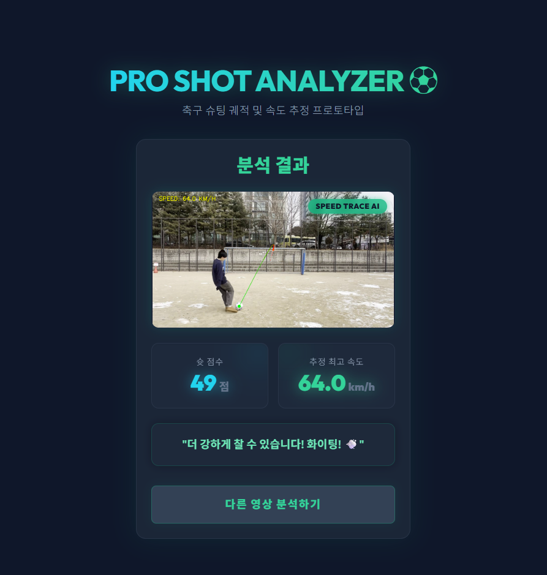
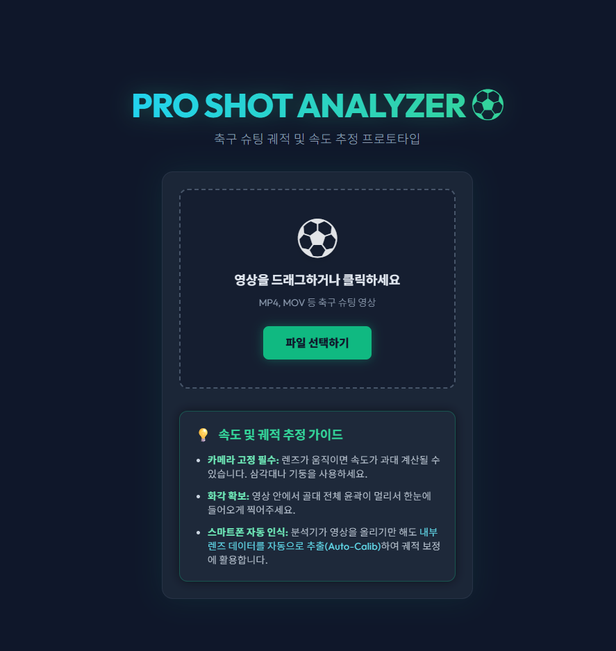
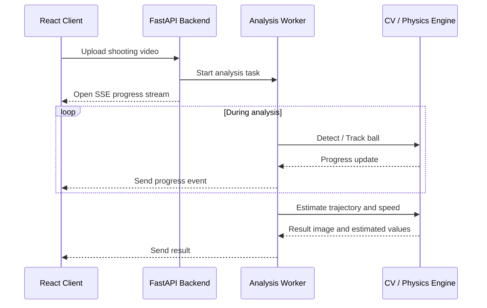

# AI Agent-based Soccer Shooting Analysis Prototype

단일 카메라로 촬영한 축구 슈팅 영상에서 공의 2D 이동을 추적하고, 카메라 보정 정보와 단순화된 물리 모델을 활용해 속도와 궤적을 **추정·시각화**하는 웹 서비스 프로토타입입니다.

이 프로젝트는 정밀 스포츠 계측 시스템이 아니라, **AI Agent를 활용해 CV 분석 파이프라인과 FastAPI 기반 AI 서비스 흐름을 빠르게 프로토타이핑한 보조 포트폴리오**입니다.


https://github.com/user-attachments/assets/1491df93-ec3d-40b1-942b-b77e2e096dba


---

## 1. Project Summary

- **Backend**: FastAPI, Uvicorn, Python-multipart
- **AI & CV**: YOLOv8, YOLOv8-seg based goalpost segmentation, OpenCV, CSRT Tracker
- **Scientific Computing**: SciPy, NumPy
- **Frontend**: React, Vite, Tailwind CSS
- **Purpose**: 영상 업로드, AI/CV 분석, 진행률 스트리밍, 결과 시각화를 하나의 웹 서비스 흐름으로 연결하는 프로토타입 구현

이 프로젝트의 핵심은 축구공 속도를 정확히 계측하는 것이 아니라, **무거운 AI/CV 분석 작업을 웹 서비스 구조에 연결하는 흐름**을 구현한 것입니다.

---

## 2. Demo

### Demo Video

[](assets/demo.mp4)

### Screenshots

| Upload Page | Result Page |
| --- | --- |
|  |  |

> Note: Demo video and screenshots are used to show the service flow: video upload, progress streaming, and result visualization. The displayed speed and trajectory are estimated values, not ground-truth measurements.

---

## 3. Scope & Boundaries

본 프로젝트는 단일 카메라 기반 분석이므로 깊이 축에 대한 모호성, 즉 **Depth Ambiguity**가 존재합니다. 또한 레이더 건, IMU, 멀티뷰 카메라 등 Ground Truth 장비와 비교 검증한 것이 아니므로, 산출되는 속도와 궤적은 정밀 측정값이 아니라 **추정값**입니다.

### 저장소 기준 확인 가능한 구현 범위

- **YOLOv8 기반 공 검출**
  - 사전 학습 YOLOv8 모델을 활용해 영상 내 sports ball 후보를 탐지합니다.

- **YOLOv8-seg 기반 골대 영역 추정**
  - 골대 세그멘테이션 모델을 활용해 골대 영역을 탐지하고, 표준 골대 너비를 기준으로 scale estimation에 활용합니다.

- **YOLO + CSRT Hybrid Tracking**
  - YOLO 검출이 불안정한 구간에서 OpenCV CSRT Tracker를 사용해 공 위치 추적을 보완합니다.

- **Trajectory / Speed Estimation**
  - 중력과 단순화된 횡가속도 항을 포함한 물리 모델을 사용하고, SciPy `least_squares`를 활용해 2D 추적 좌표와 모델 간 오차가 작아지도록 궤적 파라미터를 피팅합니다.

- **SSE Progress Streaming**
  - 영상 분석처럼 시간이 걸리는 작업의 진행률을 FastAPI `StreamingResponse`와 React `ReadableStream` 기반으로 클라이언트에 전달합니다.

- **Result Visualization**
  - 추정된 궤적과 속도 정보를 오버레이 이미지 형태로 생성하고 프론트엔드에서 확인할 수 있도록 구성했습니다.

### 확인 또는 추가 검증이 필요한 범위

- Ground Truth 장비 기반 속도 오차 검증
- 다양한 촬영 각도와 조명 환경에서의 일반화 성능
- 골대가 부분적으로 가려진 상황에서의 scale estimation 안정성
- 모바일 카메라 흔들림과 모션 블러에 대한 보정
- 상용 스포츠 분석 시스템 수준의 정확도 검증

---

## 4. Architecture

1. 사용자가 React 프론트엔드에서 슈팅 영상을 업로드합니다.
2. FastAPI 백엔드는 업로드된 영상을 저장하고 분석 작업을 별도 worker 흐름으로 실행합니다.
3. 분석 진행률은 SSE를 통해 클라이언트에 전달됩니다.
4. 분석 엔진은 공 검출, tracking, scale estimation, 궤적 파라미터 피팅을 수행합니다.
5. 최종 결과는 속도/궤적 추정값과 오버레이 이미지로 반환됩니다.



---

## 5. Project Structure

```text
.
├── backend/
│   ├── main.py              # FastAPI API server and SSE streaming
│   ├── analyze_shot.py      # YOLO/OpenCV/SciPy based analysis pipeline
│   ├── calibrate.py         # Camera calibration utility
│   └── requirements.txt
├── frontend/
│   ├── package.json
│   └── src/
│       ├── App.jsx
│       └── components/
│           ├── Upload.jsx
│           └── Result.jsx
├── assets/
│   ├── main_screen.png
│   ├── result_screen.png
│   └── demo.mp4
└── README.md
```

---

## 6. AI Agent Usage

이 프로젝트에서는 AI Agent를 요구사항 분해, 구현 초안 작성, 라이브러리 사용법 탐색, 오류 원인 후보 정리, README 문서화 보조에 활용했습니다.

### AI Agent가 보조한 부분

- FastAPI 기반 영상 업로드 API 구조 초안 작성
- SSE progress streaming 구조 설계 보조
- YOLO / OpenCV / SciPy 기반 분석 파이프라인 구현 아이디어 정리
- React 업로드 화면, progress bar, result view 구성 보조
- 오류 원인 후보 정리 및 문서화 보조

### 직접 판단하고 검증한 부분

- 단일 카메라 기반 분석의 한계를 고려해 결과를 “정밀 측정”이 아니라 “추정 및 시각화”로 포지셔닝
- 골대 규격을 활용한 scale estimation 방식 적용
- 실제 업로드, 진행률 표시, 결과 이미지 생성 흐름 확인
- README와 포트폴리오 문구에서 과장 표현 제거
- 프로젝트를 메인 포트폴리오가 아니라 Agentic AI 활용 보조 프로젝트로 정리

---

## 7. Limitations

- **Ground Truth 부재**
  - 레이더 건, IMU, 멀티뷰 카메라 등 실제 계측 장비와 비교 검증한 값이 아니므로 속도와 궤적은 추정값입니다.

- **Depth Ambiguity**
  - 단일 카메라 2D 영상만 사용하므로 Z축 깊이 변화 추정에는 구조적 한계가 있습니다.

- **환경 민감성**
  - 카메라 흔들림, 프레임레이트, 조명, 모션 블러, 촬영 각도에 따라 공 검출과 궤적 추정 결과가 달라질 수 있습니다.

- **Scale Estimation 한계**
  - 골대 탐지 결과와 실제 촬영 각도에 따라 scale estimation 오차가 발생할 수 있습니다.

- **Prototype Scope**
  - 본 프로젝트는 상용 스포츠 분석 시스템이 아니라, AI/CV 분석 파이프라인과 웹 서비스 흐름을 검증하기 위한 프로토타입입니다.

---

## 8. Getting Started

### Backend

```bash
cd backend
pip install -r requirements.txt
uvicorn main:app --reload
```

### Frontend

```bash
cd frontend
npm install
npm run dev
```

### Required Local Files

The following files are not included in this repository due to file size and data ownership concerns.

```text
backend/goal_segment_best.pt
backend/yolov8s.pt 
sample videos
generated result videos/images
calibration.json
```

> Note: This project requires model weights and sample videos to run the full analysis pipeline. Without these local assets, the repository should be reviewed mainly for code structure, service flow, and portfolio documentation.

---

## 9. Portfolio Note

이 프로젝트는 NHN AI 전환 백엔드 개발 지원에서 메인 포트폴리오가 아니라, **AI Agent 기반 빠른 프로토타이핑과 AI 분석 백엔드 흐름 구현 경험을 보여주는 보조 프로젝트**입니다.

메인 프로젝트인 AI Text Moderation Backend가 FastAPI, PostgreSQL, Docker Compose, structured logging, CI, 성능 테스트, review workflow 중심의 AI Model Serving Backend라면, 이 프로젝트는 영상 기반 AI 분석 작업을 FastAPI 비동기 처리, SSE 진행률 스트리밍, React 결과 UI와 연결한 사례입니다.

핵심 메시지는 다음과 같습니다.

> AI 기능은 모델 추론만으로 완성되지 않으며, 사용자가 업로드하고 기다리고 결과를 확인하는 전체 서비스 흐름까지 함께 설계되어야 한다.
