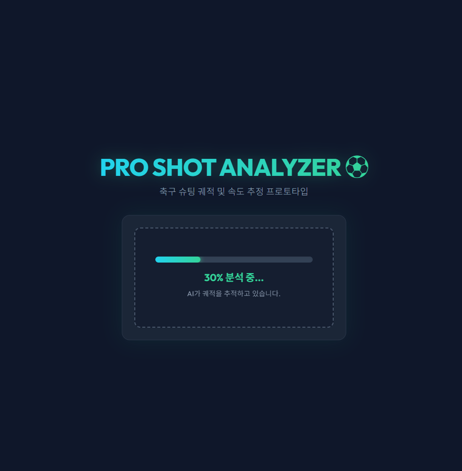
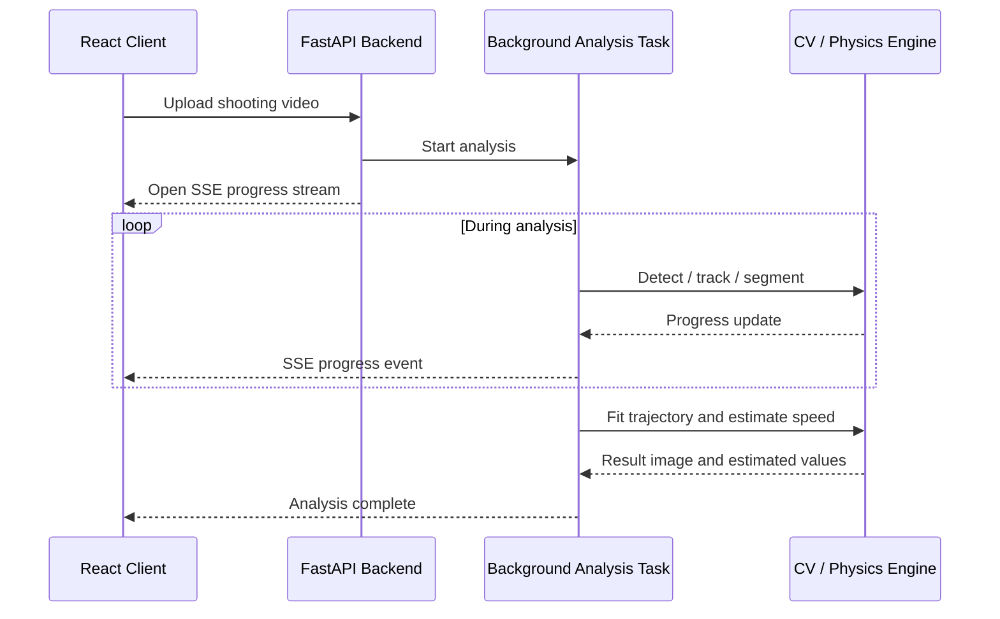

# Soccer Shooting Analysis Prototype

단일 카메라 축구 슈팅 영상의 공 검출·tracking·궤적 fitting 결과를 **FastAPI backend, SSE progress streaming, React UI**에 연결한 CV web prototype입니다.

YOLOv8, OpenCV CSRT, YOLOv8-seg, SciPy `least_squares`를 활용했습니다. 산출되는 속도와 궤적은 레이더 건·IMU·멀티뷰 카메라로 검증된 정밀 측정값이 아니라, **단일 카메라 영상에 기반한 추정값**입니다.

## Highlights

- FastAPI 기반 영상 upload / analysis / result API
- 시간이 오래 걸리는 영상 분석을 background task로 처리
- SSE 기반 분석 진행률 streaming
- React 기반 upload / progress / result UI
- YOLOv8 기반 ball detection
- OpenCV CSRT tracking fallback
- YOLOv8-seg 기반 goalpost segmentation
- SciPy `least_squares` 기반 trajectory fitting
- Agentic AI-assisted prototyping과 human validation
- 단일 카메라 한계와 claim boundary 명시

---

## 1. Demo

### Demo Video

https://github.com/user-attachments/assets/1491df93-ec3d-40b1-942b-b77e2e096dba

### Screenshots

| Upload | Analysis Progress | Result |
|---|---|---|
|  |  |  |

> 화면에 표시되는 속도와 궤적은 Ground Truth 장비로 검증된 계측값이 아니라 단일 카메라 분석에 기반한 추정값입니다.

---

## 2. Scope and Boundaries

| 구분 | 범위 |
|---|---|
| Backend | 영상 upload, analysis task 생성, progress stream, result 반환 |
| CV | YOLOv8 detection, CSRT tracking, goalpost segmentation |
| Estimation | scale estimation, trajectory fitting, speed estimation |
| Frontend | React upload, progress bar, result visualization |
| 검증 범위 | 제한된 sample 영상 기반 end-to-end flow 확인 |
| 미검증 범위 | radar/IMU Ground Truth, multi-view calibration, 상용 수준 정확도 |

이 프로젝트는 정밀 스포츠 계측 시스템이 아니라, **CV 분석 pipeline을 web service flow에 연결한 prototype**입니다.

---

## 3. Service Architecture



전체 흐름:

```text
Video Upload
→ FastAPI API
→ Background Analysis Task
→ SSE Progress Streaming
→ CV Analysis Pipeline
→ Result Overlay
→ Result API
→ React UI
```

---

## 4. Backend Flow

### 4.1 Upload and Analysis Task

사용자가 업로드한 영상을 저장하고 분석 task를 생성합니다.

영상 분석은 일반적인 짧은 API 요청보다 오래 걸릴 수 있으므로, 요청 처리와 분석 작업을 분리하고 진행 상태를 별도로 관리합니다.

### 4.2 SSE Progress Streaming

FastAPI `StreamingResponse`와 React `ReadableStream`을 사용해 분석 진행률을 전달합니다.

```text
Analysis Start
→ 10%
→ 30%
→ 60%
→ 90%
→ Complete
```

이 구조를 통해 사용자는 분석이 끝날 때까지 빈 화면을 기다리는 대신 현재 진행 상태를 확인할 수 있습니다.

### 4.3 Result Response

분석이 끝나면 다음 정보를 frontend에 전달합니다.

- 추정 속도
- trajectory parameter
- result overlay image
- 분석 완료 상태
- 기타 시각화용 metadata

---

## 5. CV Analysis Pipeline

```text
Input Video
  ↓
Frame Extraction
  ↓
YOLOv8 Ball Detection
  ↓
CSRT Tracking Fallback
  ↓
YOLOv8-seg Goalpost Segmentation
  ↓
Scale / Reference Estimation
  ↓
SciPy least_squares Trajectory Fitting
  ↓
Result Overlay
```

### 5.1 Ball Detection

사전 학습된 YOLOv8 모델로 `sports ball` candidate를 탐지합니다.

공은 크기가 작고 빠르게 움직이므로 motion blur, 조명, 배경에 따라 detection이 누락될 수 있습니다.

### 5.2 CSRT Tracking Fallback

YOLO detection이 불안정한 구간에서는 OpenCV CSRT tracker로 공 위치 추적을 보완합니다.

```text
YOLO detection success
→ detection result 사용

YOLO detection missing
→ CSRT tracking result 활용
```

Tracking은 detection을 완전히 대체하는 것이 아니라, 일시적인 누락 구간을 보완하는 fallback입니다.

### 5.3 Goalpost Segmentation

YOLOv8-seg 기반 모델로 goalpost 영역을 추정하고, 알려진 골대 규격을 scale estimation의 reference로 사용합니다.

골대가 가려지거나 촬영 각도가 크게 달라지면 scale estimation 오차가 증가할 수 있습니다.

### 5.4 Trajectory Fitting

추적된 2D 좌표에 대해 단순화된 물리 모델을 적용하고, SciPy `least_squares`로 좌표와 모델 사이의 오차가 작아지도록 parameter를 fitting합니다.

```text
Tracked 2D Points
+ Simplified Motion Model
→ least_squares optimization
→ Estimated trajectory parameters
```

단일 카메라에서는 Z축 깊이를 직접 관측할 수 없기 때문에 결과는 정밀한 3D trajectory가 아니라 제한된 가정에 기반한 추정입니다.

---

## 6. Agentic AI Usage and Human Validation

Agentic AI는 빠른 prototype 개발을 위한 pair-programming 도구로 활용했습니다.

### Agentic AI가 보조한 부분

- 요구사항을 backend / CV / frontend task로 분해
- FastAPI upload API와 SSE 구조 초안
- YOLO / OpenCV / SciPy pipeline 구현 아이디어
- React upload / progress / result UI 초안
- 오류 원인 후보 탐색
- README와 limitation 문서화 보조

### 직접 판단하고 검증한 부분

- 프로젝트를 정밀 스포츠 계측이 아닌 prototype으로 정의
- 단일 카메라의 depth ambiguity를 명시
- 결과를 측정값이 아니라 추정값으로 제한
- upload → progress → result flow 실행 확인
- 실제 result overlay 생성 확인
- 과장된 정확도·상용 수준 표현 제거
- 최종 claim과 limitation 범위 결정

AI가 제안한 결과는 실행·디버깅·영상 분석 결과 확인을 거쳐 반영했습니다.

---

## 7. Project Structure

아래는 핵심 source와 문서 기준의 구조입니다.

```text
soccer-shot-analyzer/
├── backend/
│   ├── main.py                 # FastAPI API and SSE
│   ├── analyze_shot.py         # CV / trajectory analysis pipeline
│   ├── calibrate.py            # camera calibration utility
│   └── requirements.txt
│
├── frontend/
│   ├── package.json
│   └── src/
│       ├── App.jsx
│       └── components/
│           ├── Upload.jsx
│           ├── Progress.jsx
│           └── Result.jsx
│
├── assets/
│   ├── main_screen.png
│   ├── progress_streaming.png
│   └── result_screen.png
│
├── docs/
│   └── limitations.md
│
├── .gitignore
└── README.md
```

실험·진단용 script는 최종 source와 구분해 `tools/debug/` 또는 `tests/manual/` 아래에서 관리하는 것을 원칙으로 합니다.

---

## 8. Getting Started

### 8.1 Backend

```bash
cd backend
pip install -r requirements.txt
uvicorn main:app --reload
```

### 8.2 Frontend

```bash
cd frontend
npm install
npm run dev
```

### 8.3 Required Local Files

다음 파일은 용량과 데이터 권한 문제로 repository에 포함하지 않습니다.

```text
backend/goal_segment_best.pt
backend/yolov8s.pt
sample videos
generated result videos/images
calibration.json
```

전체 분석 pipeline 실행에는 model weight, calibration data, sample video가 필요합니다. 공개 repository에서는 code structure, service flow, screenshots, demo video를 중심으로 구현 내용을 확인할 수 있습니다.

---

## 9. Evidence

| Evidence | Link |
|---|---|
| Upload Screen | [보기](./assets/main_screen.png) |
| SSE Progress Screen | [보기](./assets/progress_streaming.png) |
| Result Overlay | [보기](./assets/result_screen.png) |
| Demo Video | [보기](https://github.com/user-attachments/assets/1491df93-ec3d-40b1-942b-b77e2e096dba) |

Evidence의 목적은 다음 end-to-end 흐름을 보여주는 것입니다.

```text
영상 업로드
→ 분석 시작
→ SSE 진행률 표시
→ 분석 완료
→ result overlay 확인
```

---

## 10. Limitations

- 레이더 건, IMU, multi-view camera와 비교한 Ground Truth가 없음
- 단일 카메라 2D 영상의 depth ambiguity
- camera angle, frame rate, lighting, motion blur에 대한 민감성
- goalpost segmentation 결과에 따른 scale estimation 오차
- ball detection 누락 가능성
- CSRT tracker drift 가능성
- 제한된 sample 영상 중심의 prototype
- 정량적인 speed/trajectory accuracy metric 미제시
- production deployment와 monitoring 미구현

---

## 11. Future Work

- radar 또는 IMU 기반 speed validation
- multi-view camera calibration
- ball detection dataset fine-tuning
- re-detection과 tracker reset 전략
- camera shake compensation
- 다양한 촬영 환경 validation
- analysis job persistence
- timeout / cancel / failure state 처리 강화
- deployment와 observability 추가

---

## 12. Core Takeaway

이 프로젝트의 핵심은 CV 추론 코드를 단독으로 실행한 것이 아니라, 사용자가 영상을 업로드하고 분석 진행률을 확인한 뒤 결과를 받아보는 전체 service flow를 구현한 경험입니다.

```text
Video Upload
+ Background Analysis
+ SSE Progress
+ CV Pipeline
+ Result Visualization
= User-facing AI Analysis Service
```
